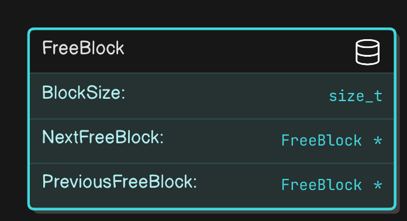
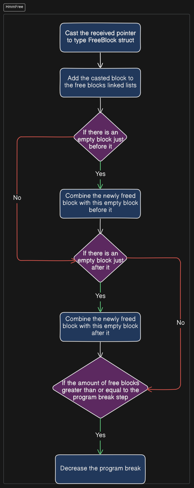
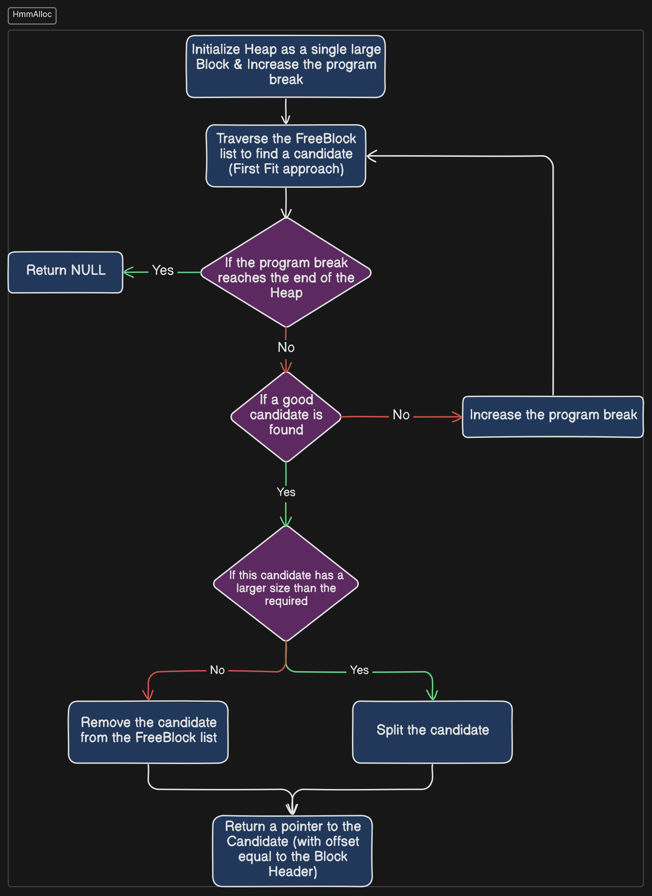

# Heap Manager V1.0
This version is just a simulation to the heap memory and its main functions (malloc and free). Heap is simulated by a large static array (saved in the .bss section). The program break is simulated by a variable which grows and shrinks by a configurable constant step.

# HmmFree
This function recevies a pointer as an argument and adds it to the "Free blocks linked list". This linked list is composed of blocks illustrated by the following image.



These Free Blocks are represented by a struct whose members are: 
- BlockSize: The size of this block in bytes
- NextFreeBlock: a pointer to the next free block    
- PreviousFreeBlock: a pointer to the previous free block    

When this function receives a pointer, it casts it to FreeBlock type (the type of the struct). Then, it addes it to the Free blocks linked list (by assigning the suitable addresses in the next and previous pointers). 

After that, it search for adjacent free blocks to combine them into single large block (in order ro prevent fragmentation). 

The following figure illustrate the flow of the function:



# HmmMalloc

This function receives the requested size in bytes and returns a void pointer to the allocated block. If the allocation fails, it returns NULL. 

- First, the function traverse the free blocks linked list for a good candidate (In my project, First Fit approach is used). 

- If no candidate is found, it returns NULL. 

- If the good candidate is larger than the requested size, this candidate gets splitted into two blocks, the first block with the requested size, and the second one which contains the remaining size will be returned to the linked list. 

- If the found canditate has exactly the same size as the requested sizem no splitting occures. 

- After that, a pointer which points to the begining of the block (meaning that it skipps the header part and points directly to the block) is returned by the function. 

the following figure illustrates the operation of the HmmMalloc




# Compilation and Running:
use the following commands to compile and run the program:

```
make
./output
```


