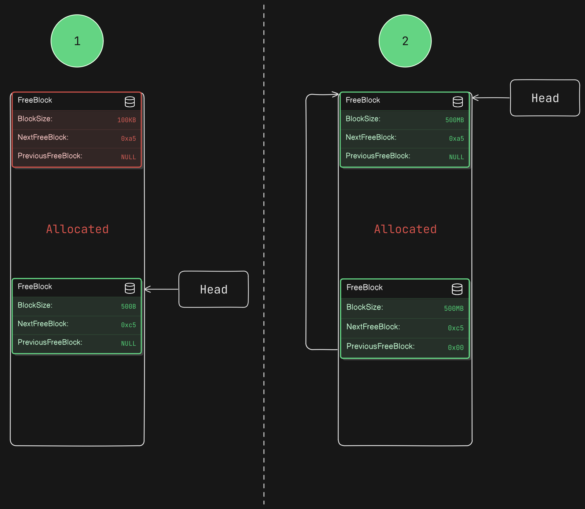

# 💾 Heap Memory Manager

## 📕 Table of Contents

- [Introduction](#Introduction)
- [HmmAlloc Implementation](#hmmalloc-implementation)
- [HmmFree Implementation](#hmmfree-implementation)
- [HmmCalloc Implementation](#hmmcalloc-implementation)
- [HmmRealloc Implementation](#hmmrealloc-implementation)
- [Compilation and Running](#compilation-and-running)

## 💡 Introduction

The Heap Memory Manager project implements custom dynamic memory allocation functions `HmmAlloc`, `HmmFree`, `HmmCalloc`, and `HmmRealloc`. This project is designed to mimic the behavior of the standard `malloc`, `free`, `calloc`, and `realloc` functions, but with additional control and customization for educational purposes and experimentation.

The implementation represents free blocks by a linked list. Each node "block" has the following struct:


Where the `BlockSize` is the suze of the block without the meta data, `NextFreeBlock` represents a pointer to the next free node, and `PreviousFreeBlock` represents a pointer to the previous free block.

The implementation is divided into two phases:

1. **Simulated Heap**: In this phase, the heap memory is simulated using a large static array, and the program break is represented by a simple variable. This version is available in the `Phase1` branch.

2. **Real Heap**: In this phase, the `sbrk` system call is used to manage the actual program break, allowing for memory allocation in the real heap. This version is the more advanced and realistic implementation.

## 📦 HmmAlloc Implementation

First of all, if it's the first time `HmmAlloc` is called, the Init function of heap is called. This `Heap_Init` function moves the program break with a constant "configurable" step size. Then, Heap is initialized as a single large block as illustrated in the following figure:
- Size: all Heap size but discarded from it the metadata size (which is 24 bytes in this case) 
- Next & Previous pointers: Initialized to NULL.

Finaly, a pointer points to the beginning of the data section (after the meta data) is returned to user.


HmmAlloc uses "First Fit" approach in which it traverses the free blocks linked list to find a block that fits the required size. The following illustrated the different scenarios in using HmmAlloc:

### HmmAlloc scenarios:

1. The found block is larger than the required size BUT T\the remaining block is smaller than the minimum valid size:

If the remaining block is smaller than the meta data size + the minimum valid size (which is 8 bytes), splitting can't be done here. Thus, the entire block is allocated to user.

The remove logic itself have multiple scenarios:

 - Only one node in the linked list

 in this case, the head will simply points no NULL.
 

 - The node to be removes is the first block in the heap:

 In this case, the head will simply move to the next free block

 

 - The node to be removed is the last node in th e linked list:

 In this case, the next pointer of the previous block is updated so that it points to NULL.

 

 - The node to be removed is a middle node:

 In this case, the previous node's next pointer and next node's previous pointer will be updated as illustrated in the following figure:


2. The remaining block is larger than or equal the minimum valid size;:

 In this case, the block is safely splitted into two blocks: the first one with the required size from user and second one contains the remaining size of the heap. The following figure illustrates this case. Finaly, the next and previous pointers of the previous and next block will be updated


## 🗑️ HmmFree Implementation

This function takes pointer as a parameter and then add it to the free blocks linked list in the correct location. This addition process can face multiple scenarios:

- Addition at the begining of the linked list:


- Addition in the end of the linked list:


- Addition in the middle of the linked list:


After the addition of the block, if it's found that the newly added block is adjacent to the previous or the next block, a merge operation is done to prevent fragmentation. The following figure illustrates the two different scenarios:


## 🎁 HmmCalloc Implementation

The `HmmCalloc` function calls the `HmmAlloc` function and initialize the returned pointer with zero,

## 🔄 HmmRealloc Implementation

This function takes the old pointer as an argument as well as the new size. 
- if the new size is zero ; The call is equivalent to `HmmFree`.
- The `HmmRealloc` calls `HmmAlloc` with the new size.
- It copies the content of the old pointer to the new pointer
- It frees the old pointer and returns the new pointer

## ⛏ Compilation and Running

To compile and run the Heap Memory Manager, follow these steps:

1. **Clone the repository**:
    ```bash
    git clone https://github.com/asabry7/HeapMemoryManager.git
    ```

2. **Checkout to the desired branch**:
   - For the simulated heap version:
     ```bash
     git checkout Phase1
     ```
   - For the real heap version:
     ```bash
     git checkout Phase2
     ```

3. **Compile the program**:
    ```bash
    make
    ```

4. **Run the program**:
    ```bash
    ./output
    ```

</br>

### To compile and run the Heap Memory Manager as a dynamic library, follow these steps:

1. **Compile all c files in ./DMA directory to object files**
    ```bash
    cd ./DMA
    gcc -c -fPIC *.c
    ```

2. **Create the shared object**
    ```bash
    gcc -shared -o libmydma.so *.o
    ```

3. **If you want to use it in a main.c file:**

    - Include it in your file:

    ```c
    #include <mydma.h>
    ```
    - Compile the main.c file:

    ```bash
    gcc -o main main.c -I ./DMA/ -L ./DMA/ -lmydma
    ```

    - Run the main.c file:

    ```bash
    LD_LIBRARY_PATH=./DMA ./main
    ```

4. **If you want to run it applications like vim, bash or ls:**
    - Set the preload variable to ./DMA/libmydma.so and run the program in the same line:
    
    ```bash
    LD_PRELOAD=./DMA/mylib.so vim
    ```


For more details on testing the program, please check the following video:


[Testing](https://drive.google.com/file/d/1yd4chFI5JQRPfnp4612bpDyUKyuUgNO0/view?usp=sharing)